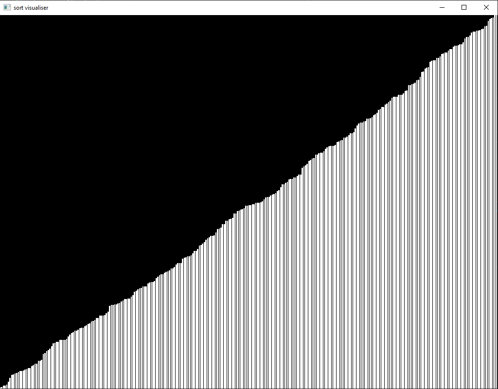

# SFML Visualizer of sorting array's
## Build:
 `x86 system, VS 2015`
### Types of sorting:
 - Merge sort
 - Bubble sort
 - you can add any other sort method
### about implementation:
 - code : c++
 - framework : SFML (system, graphics)
 - program has at least 3 threads - render thread, worker thread(data updater) and sort thread (logic sorting)
 - there are no blocks on the threads
 - flexible settings(rand generation, array size etc)
 ### showcase:
 